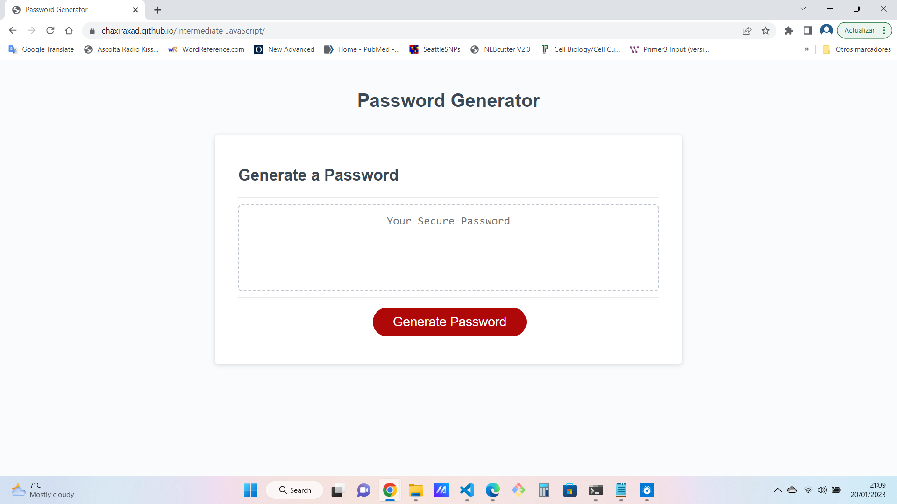

# -Intermediate-JavaScript
Module 5 Challenge

## Description
Create an application that an employee can use to generate a random password based on criteria they've selected. This app will run in the browser, and will feature dynamically updated HTML and CSS powered by JavaScript code. 

## Prerequisites

1.Generate a password when the button is clicked

2.Present a series of prompts for password criteria
    -Length of password: at least 10 characters but no more than 64.
    -Character types
        Lowercase
        Uppercase
        Numeric
        Special characters ($@%&*, etc)

3.Code should validate for each input and at least one character type should be selected
4.Once prompts are answered then the password should be generated and displayed in an alert or written to the page

## Installation
 git clone (git@github.com:Chaxiraxad/Intermediate-JavaScript.git)

## Deployment
[Project Link] ( https://chaxiraxad.github.io/Intermediate-JavaScript/)

(ScreenShot) *****update

## Usage
N/A

## Credits
N/A

## License
Please refer to the LICENSE in the repository.

## Features
N/A

## Tests
N/A

## Resources
N/A